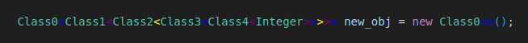

# Подсветка Угловых Скобок

Это расширение для VS Code подсвечивает угловые скобки (`<` и `>`) в вашем коде, что делает их более заметными и улучшает читаемость кода. 



*Установка:*

1. *Скомпилируйте Расширение:*

```bash
npm run compile
``` 

2. *Создайте Пакет Расширения:*

```bash
vsce package
```

3. *Установите VSIX Пакет:*
   Загрузите сгенерированный файл `.vsix` и установите его через VS Code. Вы можете сделать это, перейдя во вкладку "Расширения" (Ctrl+Shift+X) и нажав на значок шестеренки в правом верхнем углу, а затем выбрав "Установить из VSIX...".

*Поддерживаемые Языки:*

• JavaScript

• TypeScript

• Java

• HTML


*Вклад:*

Вклады приветствуются! Если вы нашли ошибку или у вас есть запрос на функцию, пожалуйста, откройте issue или отправьте pull request.


*Автор:*

Багина Татьяна, M3103

